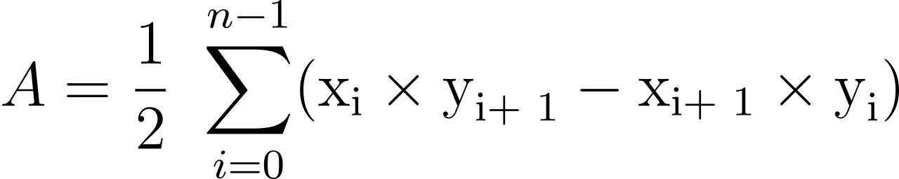

# 🐮 - PLAT Project - 🐮

>_Projet **Pas de Lait Avant la Traite**_

## Problème à résoudre 🧐

Ceci est la triste histoire d’une vache victime des facéties d’un paysan taquin.

En effet, Fernand le paysan décida un beau jour de jouer quotidiennement la blague suivante à son voisin Raoul,
également paysan : nuitamment, Fernand se rend dans le pré de Raoul, déplace tout ou partie des piquets de la
clôture et positionne la vache dudit Raoul exactement au centre de gravité du pré ainsi modifié.

Dans un premier temps, quand il s’aperçut de la plaisanterie, Raoul se contenta de bougonner. Puis il se rendit
compte que, suivant la forme du pré, le centre de gravité pouvait se situer en dehors de la clôture. Dans ce cas, la
vache peut s’évader puisqu’elle n’est plus cernée par la clôture.

Raoul ne pouvant passer ses nuits à surveiller son pré et sa vache, il décida de faire appel à quelques siens amis,
étudiants en seconde année de DUT Informatique à l’IUT d’Amiens, qui lui tinrent à peu près ce langage :

>_" Nous pouvons concevoir un programme informatique qui indique si le centre de gravité se trouve à
 l’intérieur ou à l’extérieur du pré. Il suffira de fournir au programme les coordonnées des piquets "_
 
Fort heureusement, Raoul s’est jadis lié d’amitié avec un vieil hibou savant et noctambule. Cet hibou a accepté
de relever à l’aide d’un smartphone la position des piquets de clôture juste après que Fernand ait changé leur
position, puis de transmettre ces informations à Raoul. Ainsi, ce dernier pourra exécuter le programme et, selon
la réponse, laisser sa vache au pré (si le centre de gravité se situe dans le pré) ou la rentrer à l’étable (si le centre
de gravité se situe hors du pré).

**Ces étudiants, c’est nous !**

## La programmation

Le programme à rédiger accepte en entrée le nombre de piquets formant la clôture, puis les coordonnées cartésiennes
(x, y) de ces piquets. Elles sont données dans l’ordre, comme si l’on suivait le fil de la clôture, dans le sens inverse
des aiguilles d’une montre. La clôture est fermée sur elle-même et les fils ne se croisent jamais.

Raoul ne possède que cinquante piquets. Le nombre de piquets utilisés ne peut donc dépasser cette valeur.

Le programme détermine les coordonnées du centre de gravité de la clôture, puis indique si celui-ci se trouve à
l’intérieur.

On donne ci-dessous un exemple d’exécution du programme en mode console sous Unix :

    $ ./vache
    Saisir le nombre de piquets
    4
    
    Saisir le piquet 1
    -1.1
    -1.5
    Saisir le piquet 2
    2.1
    3.012
    Saisir le piquet 3
    5.6
    -1.21
    Saisir le piquet 4
    1.97
    4.07
    
    Aire = 3.563150
    
    Centre de gravité : 1.978486, 1.903452
    
    Attention, la vache est hors du pré
    $

Attention : dans ce qui suit, on suppose que les n segments de la clôture sont numérotés de 0 à n-1.

#### Aire d’un polygone régulier

#### Centre de gravité

A partir de l’aire A, on calcule l’abscisse Gx du centre de gravité :

L’ordonnée Gy du centre de gravité vaut :

